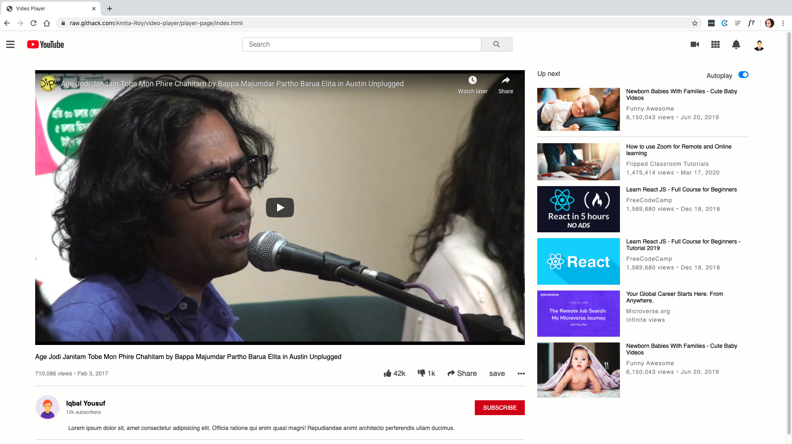

# video-player

> Embedding Images and Video

- Live demo [@video-player](https://raw.githack.com/Amita-Roy/video-player/player-page/index.html)

## Built With

​

- HTML
- CSS
  ​

## Getting Started

​
**To get a local copy up and running follow these simple example steps.**
​
​

### Prerequisites

A computer.
A browser of preference.
​

## Authors

​
👤 **Amita Roy**
​

- Github: [@githubhandle](https://github.com/Amita-Roy)

👤 **Ershadul Hakim Rayhan**
​

- Github: [@githubhandle](https://github.com/ershadul1)
  ​

## �� Contributing

​
Feedback is always appreciated! Help us by adding an issue.
​

## Show your support

​
Give a ⭐️ if you like this project!
​

## Acknowledgments

​

- A Big thanks to Youtube.
  ​

## �� License

​
This project is [MIT](lic.url) licensed.
